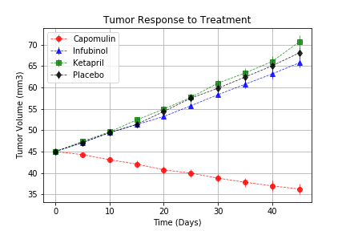
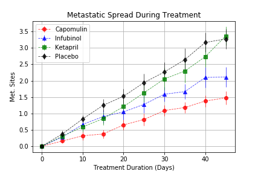
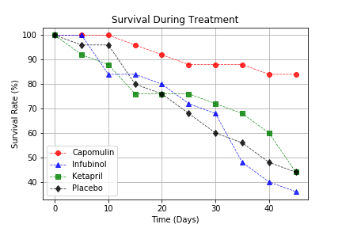
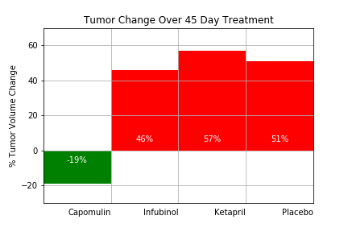

# matplotlib-challenge
## Python Homework - Pymaceuticals
* Due on Saturday: October 12, 2019

## matplotlib-challenge folder: 
* NotUsed - pymaceuticals_starter.ipynb : referenced as example solution
* README.md
	## Pymaceuticals Folder contains:
	* HW05_pymaceuticals.ipynby : homework script and observation analysis written in here
	+ data/clinicaltrial_data.csv
    + data/mouse_drug_data.csv
    + Images/img1_treatment.png
    
    
    
    + Images/img2_spread.png
    
    
    
    + Images/img3_survival.png
    
    
    
    + Images/img4_change.png
    
    
    
## Purpose: Use pandas library and Matplotlib library to organize and create summary data frame and various graphs.